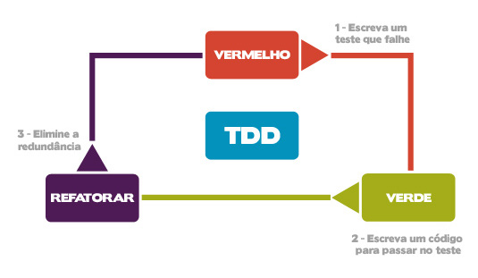

# Aprenda a aplicar testes com Java

### Objetivos da aula
<p><li>Conceitos do JUnit 4
<li>Asserts
<li>Rules
<li>Testando Exceções<p><br/>

### Requisitos Básicos
<p><li>IDE Eclipse
<li>JDK 8
<li>Maven
<li>JUnit 4<p><br/>

## Testes unitários com JUnit 4
<p><li>Framework simples e de código aberto
<li>Teste unitários
<li>Organização do código
<li>Testar sempre<p><br/>

## Explorando Mocks e Asserts

<ul><b>O que são Mocks?</b></ul>
<p>Objetos Mock, objetos simulados ou simplesmente Mock;</p>
<p>Razões para utilizar: utilizado para descrever um caso especial de objetos que imitam objetos reais para teste unitários</p>
<p>Limitações: "Um objeto mock tem precisamente o modelo do comportamento do objeto que ele está simulando ("mocking"). O comportamento correto pode se tornar difícil de se obter se o objeto que está sendo simulado ("mocked") foi feito por outro desenvolvedor, ou, quando esse não tenha sido escrito ainda. Se o comportamento não for modelado corretamente, então os testes unitários devem registrar que o teste passou mesmo se uma falha ocorresse no tempo de execução, nas mesmas condições que o teste está exercendo e dessa forma, tornando inútil o teste unitário."</p><br/>

### Principais Frameworks
<li>Mockito - Permite que sejam construidos testes com API simples e clara. Ajuda a produzir teste legíveis e eventuais erros de fácil verificação; 
<li>EasyMock - Foi o primeiro gerador de objetos Mock e influenciou a criação do Mockito
<li>PowerMockito - PowerMockito é uma API de extensão da PowerMock para apoiar a Mockito. Ele fornece capacidades para trabalhar com a API Java Reflection de uma maneira simples para superar os problemas da Mockito, tais como a falta de capacidade de mockar de métodos finais, estáticos ou privados.

## Asserts
<p>Class Assert</p>
<p>java.lang.Object</p>
<p>extended by org.junit.Assert</p>

<p>public class Assert</p>
<p>extends java.lang.Object</p>

<p>A set of assertion methods useful for writing tests. Only failed assertions are recorded. These methods can be used directly: Assert.assertEquals(...), however, they read better if they are referenced through static import:</p>

<p>import static org.junit.Assert.*;</p>
    <p>...</p>
<p>assertEquals(...);</p>

<p><a href="https://www.guru99.com/junit-assert.html">Alguns métodos assert</a></p><br/>

## Hamcrest e Matcher

### Hamcrest 
<p><a href="https://github.com/hamcrest/JavaHamcrest">Hamcrest</a> is a library of matchers, which can be combined in to create flexible expressions of intent in tests. They've also been used for other purposes.</p>

### Matcher
```public final class Matcher```

```extends Object```

```implements MatchResult```

<p>The matcher() method is used to search for the pattern in a string. It returns a Matcher object which contains information about the search that was performed.</p><br/>

## TDD e Testes Unitários em JUnit 5 

## TDD
<p>O <a href="https://www.devmedia.com.br/tdd-fundamentos-do-desenvolvimento-orientado-a-testes/28151">TDD</a> (Test Driven Development / Desenvolvimento orientado a teste) é parte da metodologia XP e também utilizado em diversas outras metodologias, além de poder ser utilizada livremente.</p><br/>

<p>O que você tem a perder utilizando o TDD?</p>

<p>Bem segundo Freeman at al, você não tem nada a perder, a não ser os seus bugs.</p>

<p>O TDD transforma o desenvolvimento, pois deve-se primeiro escrever os testes, antes de implementar o sistema. Os testes são utilizados para facilitar no entendimento do projeto, segundo Freeman os testes são usados para clarear a ideia em relação ao que se deseja em relação ao código. Segundo Kent Beck apud Freeman “Finalmente, consegui separar o projeto lógico do físico. Sempre me disseram para fazer isso, mas nunca ninguém tinha explicado como”, o TDD é a forma de se fazer isso. A criação de teste unitários ou de componentes é parte crucial para o TDD. Segundo Presmann, “Os componentes individuais são testados para garantir que operem corretamente. Cada componente é testado independentemente, sem os outros componentes de sistema. Os componentes podem ser entidades simples, tais como funções ou classes de objetos, ou podem ser grupos coerentes dessas entidades”.</p><br/>

<p>Mas não é só o teste unitário que vai trazer o sucesso a aplicação, é necessário testar o sistema como um todo, que segundo Sommerville, “Os componentes são integrados para compor o sistema. Esse processo está relacionado com a busca de erros que resultam das interações não previstas entre os componentes”.</p>

<p>Um sistema é um conjunto de unidades integradas, por este motivo é importante os testes unitários para ver se no micromundo tudo funciona, mas também temos de testar a integração, ou seja, ao integrar dois ou mais componentes, devemos realizar testes para verificar se a integração funciona. Voltemos ao exemplo do carro, não adianta eu testar a roda, a porta, o volante, mas não testar o carro completo. Erros podem ocorrer, justamente no processo de montagem/integração de componentes.</p><br/>

<p>E qual o benefício em utilizar o TDD?

<p>Em primeira instância, torna o processo mais confiável, mas reduz custos, pois desenvolvemos e já sabemos o erro, pois como os testes são criados antes do processo de desenvolvimento, conseguimos testar constantemente. Outro ponto é que se os testes foram criados, isso quer dizer que foram entendidas as regras de negócio durante a fase de desenvolvimento dos testes unitários.</p><br/>

<p>Além disso, evita retrabalho da equipe, que ao final reduz custo e tem maior chance de sucesso.</p>

<p>O Ciclo do TDD é simples: criamos um teste -> Fazemos a codificação para passar no teste -> Refatoramos nosso código, conforme figura a seguir:</p>

<p>Ciclo do TDD</p>


<p>Notemos aqui que o teste visa auxiliar a codificação, reduzindo consideravelmente os problemas na fase de desenvolvimento. No TDD é indicado que o projeto de teste unitário ocorra antes da fase de codificação/implementação.</p>

<p>O Teste antes da codificação, ou test-first, segundo Sommerville, “a escrita de testes primeiro define implicitamente tanto uma interface como uma especificação do comportamento para a funcionalidade que está sendo desenvolvida”.</p>

<p>Note que ao criar o teste antes de implementar a unidade, são reduzidos problemas como mal entendimento de requisitos ou interfaces, pois como criar um teste se eu não sei o que devo testar?</p>

<p>Neste caso o desenvolvedor, para implementar os testes iniciais, deve compreender com detalhes a especificação do sistema e as regras de negócio, só assim, será possível escrever testes para o sistema. Imagine o caso de querer testar um pneu criado para o carro, se não entendi que o pneu é redondo, por exemplo, criarei um teste para um pneu quadrado, não podendo ser realizado o teste. Desta forma, é de extrema importância, para o desenvolvedor, o entendimento dos requisitos do cliente. Além disso, não adianta criar testes que não validem o código como um todo para reduzir o tempo, é necessário criar testes para o conjunto completo de unidades, só assim o TDD vai funcionar como deve, devendo fornecer uma cobertura completa aos testes.</p><br/>

<p>Além disso, os testes devem seguir o modelo F.I.R.S.T.</p>

<p><ul>F (Fast) - Rápidos: devem ser rápidos, pois testam apenas uma unidade;</ul>
<ul>I (Isolated) - Testes unitários são isolados, testando individualmente as unidades e não sua integração;</ul>
<ul>R (Repeateble) - Repetição nos testes, com resultados de comportamento constante;</ul>
<ul>S (Self-verifying) - A auto verificação deve verificar se passou ou se deu como falha o teste;</ul>
<ul>T (Timely) - O teste deve ser oportuno, sendo um teste por unidade.</ul></p><br/>


<p>Atualmente, existem diversas ferramentas que analisam as coberturas de teste, podendo ser baixadas gratuitamente da Internet.</p>

<p>Outra vantagem de possuir testes é a chamada regressão. Imagine que criamos os testes, fizemos o sistema e tudo foi entregue ao cliente, mas posteriormente o cliente pediu pequenas modificações no sistema, mas não nas regras de negócio. Os testes já prontos servirão para validar se as modificações não criaram problemas nas regras de negócio que já estavam em funcionamento. Este procedimento exige que testes unitários estejam prontos, aguardando ser reutilizados. Logo, segundo Silveira at al., “Um teste de unidade deve garantir que a execução daquele trecho mínimo de código esteja correta.”</p><br/>

<p>Como implementar o processo de TDD ao desenvolvimento?</p>

<p>Para começar a desenvolver seus primeiros testes, pode ser mais fácil a utilização de bibliotecas XUnit's. Existem diversas ferramentas que possibilitam esta prática, vamos a algumas:</p>

<li>JUnit: O JUnit é um framework de teste para Java, que permite a criação de testes unitários. Além disso, está disponível como plug-in para os mais diversos IDE'S como Eclipse, Netbeans etc.</p>

<li>TesteNG: Outra ferramenta de teste unitária, disponível para Java;</p>

<li>PHPUnit: Framework XUnit para teste unitário em PHP, também é possível integrar aos IDE's assim como o JUnit;</p>

<li>SimpleTest: Outra ferramenta para realização de teste para PHP. Além de possibilitar os testes unitários, é possível realizar MOCKS e outros testes;</p>

<li>NUnit: Framework de teste no molde XUnit para a plataforma .NET;</p>

<li>Jasmine: Framework para teste unitário de JavaScript;</p>

<li>CUnit: Ferramenta para os testes unitários disponível para Linguagem C;</p>

<li>PyUnit: Framework Xunit para testes na linguagem Python.</p>


## JUnit 5

### Melhorias

#### Visibilidade

<p><a href="https://www.infoq.com/br/articles/JUnit-5-Early-Test-Drive/">A mudança mais óbvia é que os métodos de testes não podem ser públicos</a>. É necessário apenas visibilidade package (também não pode ser privado), para que possamos manter as classes de testes livres da confusão de muitas palavras-chave públicas.</p>

<p>Teoricamente as classes de testes também precisam ter visibilidade default. Mas, por causa da configuração simples que acabamos de fazer, as nossas ferramentas só verificam as anotações nas classes públicas. Isso mudará após as ferramentas receberem o suporte ao JUnit 5.</p>

<p>Teste de ciclo de vida</p>

<p>@Test</p>
<p>A anotação mais básica do JUnit 4 é @Test, usada para marcar os métodos que serão executados como testes.</p>

<p>A anotação foi praticamente inalterada, embora já não tenha argumentos opcionais; as exceções esperadas podem ser verificada por meio de assertions. (Para timeouts ainda não há um substituto.)</p>

<p>@Before e @After</p>
<p>Para executar os códigos de configuração, antes e depois dos testes, podemos usar @BeforeAll, @BeforeEach, @AfterEach e @AfterAll. Estas anotações possuem nomes mais apropriado para suas funções, mas semanticamente são idênticas as anotações @BeforeClass, @Before, @After e @AfterClass do JUnit 4.</p>

<p>Como uma nova instância é criada para cada teste, os métodos @BeforeAll / @AfterAll são chamados apenas uma vez para todos eles, como não é específico para qual teste serão utilizados, ambos devem ser declarados de modo estático (semelhante ao @BeforeClass e @AfterClass no JUnit 4).</p>

<p>Se métodos diferentes são anotados com as mesma anotações, a ordem de execução é indefinida.</p>

<p>Desativando os testes</p>
<p>Os testes podem simplesmente ser desativados com @disabled, o que equivale ao @Ignored do JUnit4. Este é apenas um caso especial de um Condition, que veremos mais adiante, quando abordarmos a extensão JUnit.</p>

<p>Assertions</p>
<p>Depois de tudo criado e funcionando, utilizamos as assertions para verificar o comportamento desejado. Ocorreu diversas melhorias incrementais, como:</p>

<p>As mensagens dos assertions foram movidas para o último parâmetro. Desta forma, as chamadas com ou sem mensagens ficam mais uniformes, como os dois primeiros parâmetros são sempre os valores da informação real e esperada, e o argumento opcional vem por último;</p>

<p>Usando lambdas, as mensagens dos asserts podem ser criadas se for necessária (lazy), podendo melhorar o desempenho se esta criação é uma operação demorada;
As verificações booleanas aceitam Predicates.</p>

<p>Há também o novo assertAll, que verifica um grupo de invocações que normalmente são relacionadas e, se a alguma afirmação falhar, não para as demais validações, imprime apenas as mensagens das validações que falharam, exemplo:</p>

``` @Test
void assertRelatedProperties() {
    Developer dev = new Developer("Johannes", "Link");

    assertAll("developer",
   		 () -> assertEquals("Marc", dev.firstName()),
   		 () -> assertEquals("Philipp", dev.lastName())
    );
}
```

<p>Este teste produz a seguinte mensagem de falha:

```
org.opentest4j.MultipleFailuresError: developer (2 failures)
    expected:  but was: 
    expected:  but was:
```

<p>Note que apresenta a mensagem de falha para as duas validações.</p>

<p>Finalmente temos assertThrows e expectThrows, ambos causam a falha do teste se a exceção esperada não for lançada pelo método chamado. Mas para continuar verificando as propriedades (por exemplo, que a mensagem contém determinadas informações), o expectThrows retorna a exceção.</p>

```
@Test
void assertExceptions() {
    // assert that the method under test
    // throws the expected exception */
    assertThrows(Exception.class, unitUnderTest::methodUnderTest);

    Exception exception = expectThrows(
        Exception.class,
        unitUnderTest::methodUnderTest);
    assertEquals("This shouldn't happen.", exception.getMessage());
}
```

<p>Suposições</p>

<p>Suposições (assumptions) permitem executar testes se determinada condição for esperada. Como uma suposição, precisa ser formulada como uma expressão booleana, se a condição não for atendida o teste encerra. Isso pode ser utilizado para reduzir o tempo de execução e a verbosidade das ferramentas de testes, especialmente em casos de falha.</p>

```
@Test
void exitIfFalseIsTrue() {
    assumeTrue(false);
    System.exit(1);
}

@Test
void exitIfTrueIsFalse() {
    assumeFalse(this::truism);
    System.exit(1);
}

private boolean truism() {
    return true;
}

@Test
void exitIfNullEqualsString() {
    assumingThat(
             // state an assumption (a false one in this case) ...
   		 "null".equals(null),
             // … and only execute the lambda if it is true
   		 () -> System.exit(1)
    );
}
```

<p>As suposições podem ser usadas para abortar testes cujas pré condições não são atendidas (assumeTrue e assumeFalse) ou para executar partes específicas de um teste de acordo com a condição (assumingThat). A principal diferença é que os testes abortados são reportados como desativados, ao invés de ter um teste que fica verde porque não executou devido a alguma condição.</p>


