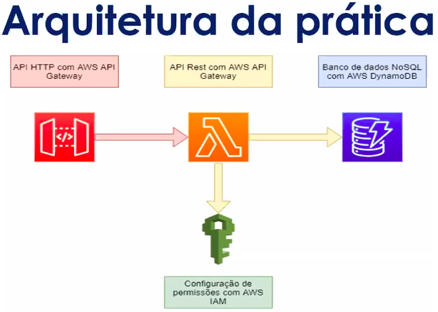

# Projeto prático na AWS

## Aula 1 - Apresentação dos objetivos do curso
<p><li>Visualizar os recursos e categorias da AWS services;
<li>Criar API HTTP com endpoints de CRUD no AWS API Gateway;
<li>Implementar serverless em NodeJS com AWS Lambda;
<li>Criar tabela no DB com AWS DynamoDB;
<li>Configurações de permissôes de acesso por roles e policies com AWS IAM;
<li>Configuração de integração entre os AWS services;</p><br/> 

## Aula 2 - Conceitos base da AWS e Arquitetura do projeto
A AWS têm origem no AWS Well-Architected Framework. Os cinco pilares consistem nas áreas:
<p><li>Segurança;
<li>Eficiência de performance;
<li>Confiabilidade;
<li>Excelência operacional;
<li>Otimização de custos;</p><br/>




## Aula 3 - Apresentação de serviços e suas categorias
<p><li>Visualização dos recursos e categorias da AWS services;<p><br/>


## Aula 4 - Criando um pool de usuários com Amazon Cognito
O que é o Amazon Cognito?

<p>O Amazon Cognito fornece autenticação, autorização e gerenciamento de usuários para os seus aplicativos móveis e web. Seus usuários podem fazer login diretamente com um nome de usuário e uma senha ou por meio de terceiros, como o Facebook, a Amazon, o Google ou a Apple.</p>

<p>Os dois componentes principais do Amazon Cognito são os grupos de usuários e os grupos de identidades. Os grupos de usuários são diretórios de usuários que fornecem opções de cadastro e login para os usuários do seu aplicativo. Os grupos de identidade permitem que você conceda aos usuários acesso a outros serviços da AWS. Você pode usar grupos de identidades e grupos de usuários separadamente ou em conjunto.</p>

### Um grupo de usuários do Amazon Cognito e um grupo de identidades usados juntos

<p><a href="https://docs.aws.amazon.com/pt_br/cognito/latest/developerguide/what-is-amazon-cognito.html">O que é o Amazon Cognito?</a>

<p>Consulte o diagrama para ver um cenário comum do Amazon Cognito. Aqui, o objetivo é autenticar o usuário e, em seguida, conceder a ele acesso a outro serviço da AWS.</p>

<p>Na primeira etapa, o usuário do aplicativo faz login por meio de um grupo de usuários e recebe tokens desse grupo após uma autenticação bem-sucedida.</p>

<p>Em seguida, o aplicativo troca os tokens do grupo de usuários por credenciais da AWS por meio de um grupo de identidades.</p>

<p>Por fim, o usuário do aplicativo pode usar essas credenciais da AWS para acessar outros serviços da AWS, como o Amazon S3 ou o DynamoDB.</p><br/>


```Amazon Cognito -> 'Manage User Pools```

```Create a user pool -> Inserir nome da pool a ser criada e escolher a opção -> 'Review defaults' ```

```Configurar maneiras de autenticação de usuário (e.g tokens, passwords, app client)  ```

```Criar usuários -> inserir username, phone number```

```Configurar atributos necessários para os users se cadastrarem(email, phone number, password policies)```

```Customização da UI - opcional - Possível criar própria ou usar padrão```

## Aula 5 - Criar tabela no DB com AWS DynamoDB e Funções Lambda
<p>O Amazon DynamoDB é um banco de dados de valores-chave e documentos que oferece desempenho em milissegundos de um dígito em qualquer escala. É um banco de dados totalmente gerenciado, multirregional, multiativo e durável com segurança, backup e restauração integrados e armazenamento em cache na memória para aplicativos em escala de Internet.</p><br/> 

```DynamoDB -> Create table```

```Inserir nome da tabela e Primary Key```

```Table Settings -> 'use default'```

```Amazon Resource Name (ARN) - Para integrar o DB```

<p>Neste menu é possível criar items, atributos, realizar consultas, gerenciar a tabela em si. Para executar código sem provisionar ou gerenciar servidores, cria-se funções Lambda na AWS Lambda.</p><br/>

### O que é o AWS Lambda?
<p>O <a href="https://docs.aws.amazon.com/pt_br/lambda/latest/dg/welcome.html#welcome-first-time-user">Lambda</a> é um serviço de computação que permite executar código sem provisionar ou gerenciar servidores. O Lambda executa seu código em uma infraestrutura de computação de alta disponibilidade e executa toda a administração dos recursos computacionais, inclusive a manutenção do servidor e do sistema operacional, o provisionamento e a escalabilidade automática da capacidade e o monitoramento e o registro em log do código. Com o Lambda, você pode executar código para praticamente qualquer tipo de aplicação ou serviço de back-end. Tudo o que você precisa fazer é fornecer o código em uma das linguagens compatíveis com o Lambda.</p><br/>

<p>O Lambda executa sua função somente quando necessário e a escala automaticamente, de algumas solicitações por dia a milhares por segundo. Você paga apenas pelo tempo de computação consumido. Não haverá cobranças quando o código não estiver em execução.</p><br/>

<p>Possibilidades de uso Lambda:</p>

<p><li>Criar triggers de processamento de dados para serviços da AWS, como Amazon Simple Storage Service (Amazon S3) e Amazon DynamoDB.
<li>Processar dados de streaming armazenados no Amazon Kinesis.
<li>Criar seu próprio back-end que opera em escala, performance e segurança da AWS.
<li>Lambda é um serviço altamente disponível. Para obter mais informações, consulte o Acordo de Nível de Serviço do AWS Lambda.</p>

<p>Mais detalhes em <a href="https://docs.aws.amazon.com/pt_br/lambda/latest/dg/welcome.html#when-to-use-cloud-functions">Quanto utilizar Lambda</a>.</p>


```'Lambda' -> 'Functions' -> 'Create function'```

```Nos templates escolher 'Author from scratch' - começando do 0 com um exemplo simples```

```Atribuir nome a função em -> 'Function name'```

<p>É recomendável usar o Runtime mais atualizado.</p>


```No papel de execução -> 'Create a new role with basic Lambda Permissions' (criar nova permissão) e 'Create Function' para finalizar esta tarefa```

## Aula 6 - Editando o código-fonte em JavaScript

```'Configure test event' - para criar teste``` 

Marcar

```Create new test event ```

Escolher o 

```'event template'``` 

Nesse caso foi escolhido o 'hello-world'


```'Event name'```

Escolher um nome e criar ao clicar em 

```Create```

<p><a href=" ">Código de configuração em JavaScript</a> para criação de métodos POST, DELETE, GET, PUT e default.</p><br/>

## Criando uma API Gateway e routes

#### Criando a API

```API Gateway -> 'Create an API' -> Inserir 'API name' -> clicar em 'Create' ```

<p>Qualquer modificação feita na API será auto-deployed</p>

### Criando routes

<p>No menu do painel a esquerda, clicar em:</p>

```'Routes' -> Criar 'Routes e escolher métodos' -> clicar em 'create'```

<p>Criar routes para cada metodo criado: Post, Delete, Get, Put.</p>

<p>Após criar as rotas, é preciso fazer a integração</p>


## Desenvolvendo integrações

<p>Ir em</p>

```'Routes'```
Clicar no método e depois

```Attach integration```
<p>No campo</p>

```Integration targe```
<p>Escolher a 'Lambda function', verificar a região e escolher a função.</p>

Clicar em

```Create```

<p>Testar os métodos utilizando o <a href="https://www.postman.com/">Postman</a></p>

<p>Para autorizar os roles a utilizar os métodos criados, ir em 'Functions' criada, 'Permissions', 'Configuration' e clicar em 'Role name'.</p>

<p>Através do <a href="https://docs.aws.amazon.com/pt_br/IAM/latest/UserGuide/introduction.html">IAM - Identity and Access Management</a>, 'attach permissions', filter policies e escolher a 'AmazonDynamoDBFullAccess'(em produção não é recomendável) e 'AWSLambdaBasicExecutionRole...'. 

<p>Após essa mudança das Policies, os métodos funcionavam normalmente.</p>